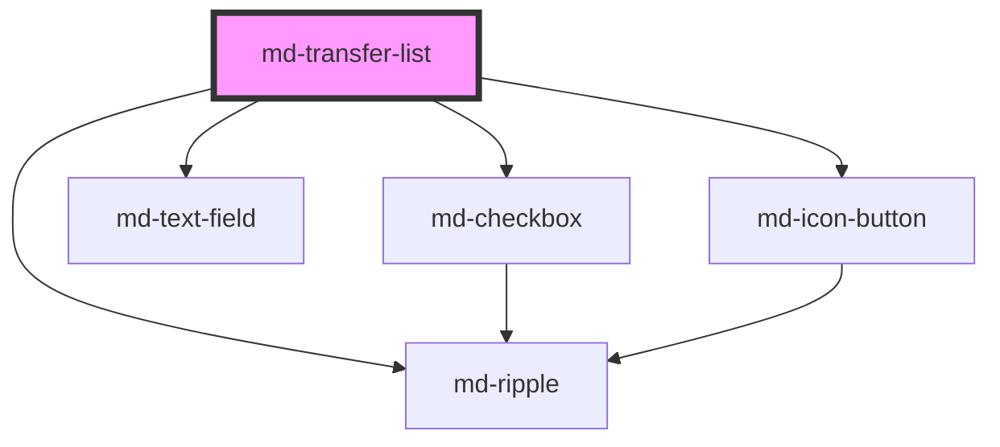

# md-transfer-list

<!-- llm:meta
tag: md-transfer-list
category: data
status: custom
m3-guidelines: none — M3 has no transfer-list component
m3-derived-from: https://m3.material.io/components/lists/guidelines
reference-parity: https://mui.com/material-ui/react-transfer-list/
form-associated: false
depends-on: md-checkbox, md-text-field, md-ripple, md-icon-button
used-by: none
-->

**A dual-list selector.** Two columns — *source* and *target* — with per-side
search, select-all headers, checkbox rows, and four movers between them. The
`value` prop is the set of item values currently in the **target** column.

> ⚠️ **Not a Material Design 3 component.** M3 has no transfer-list page. The
> Do/Don't below are derived from M3's
> [Lists](https://m3.material.io/components/lists/guidelines) and
> [Checkbox](https://m3.material.io/components/checkbox/guidelines) guidance
> plus this component's actual behavior — treat them as house rules, not spec.

> ⚠️ **Not form-associated.** It does not participate in `FormData` — read
> `mdChange` and submit the values yourself.

> Setup, theming, density and i18n are configured once for the whole library —
> see [`main-llm.md`](../../../../../main-llm.md), the library-wide specification shipped
> alongside these manuals.

---

## When to use

- Assigning a **subset out of a known, bounded pool**: users→roles,
  permissions→groups, columns→a report, tags→an article.
- The user benefits from seeing **chosen and unchosen side by side**, and from
  moving items in **batches**.
- Item counts roughly **10–300** per side.

## When NOT to use

| Situation | Use instead |
|---|---|
| Picking a handful from a short list (< ~10) | `md-multi-select` |
| Picking exactly one | `md-select` |
| Free-text entry with suggestions | `md-autocomplete` |
| A flat multi-select where order/side doesn't matter | `md-checkbox` group or `md-list` |
| Toggling a handful of independent options | `md-switch` / `md-checkbox` |
| The two sides mean different *things* (not the same items relocated) | Two separate lists |
| Narrow mobile viewports | `md-multi-select` — three columns don't fit |
| A value that must submit with a form | Mirror `mdChange` into hidden inputs yourself |

## Decision cues

| Need | Setting |
|---|---|
| Long lists users must filter | `searchable` (default `true`) |
| Short lists where search is noise | `searchable="false"` |
| Prevent accidental bulk moves | `single-step-only` — drops the `»`/`«` movers |
| No select-all checkbox in headers | `show-select-all="false"` |
| Compact rows in a dense admin UI | `density="-1"`…`"-4"` |
| Items that exist but can't be moved | `disabled: true` on the item object |
| No leading glyph in the search fields | `search-icon=""` |
| Fill the parent box | The `full-width` / `full-height` attributes |

## API contract

```ts
interface MdTransferListItem {
  value: string;        // stable identifier
  label: string;        // visible text
  description?: string; // secondary line
  disabled?: boolean;   // visible but immovable
}
```

```html
<md-transfer-list
  source-title="Choices"
  target-title="Chosen"
  searchable="true"                  <!-- default: true -->
  show-select-all="true"             <!-- default: true -->
  source-search-placeholder="Search choices"
  target-search-placeholder="Search chosen"
  count-template="{checked}/{total} selected"
  empty-text="No items"
  empty-icon=""                      <!-- default: "" (no glyph) -->
  search-icon="search"               <!-- "" for none -->
  single-step-only                   <!-- default: false -->
  disabled
  full-width                         <!-- CSS-only attribute -->
  full-height                        <!-- CSS-only attribute -->
  density="-1|-2|-3|-4"              <!-- omit for the default rung -->
  move-right-icon="chevron_right"
  move-left-icon="chevron_left"
  move-all-right-icon="keyboard_double_arrow_right"
  move-all-left-icon="keyboard_double_arrow_left"
  move-right-label="Move selected to target"
  move-left-label="Move selected to source"
  move-all-right-label="Move all to target"
  move-all-left-label="Move all to source"
></md-transfer-list>
```

`items` takes **either form** — the array as a JS property, or a JSON string as
an attribute. `value` is `string[]` and has **no attribute**: set it as a
property.

```html
<!-- Attribute form: JSON, single-quoted so the inner quotes survive -->
<md-transfer-list
  items='[{"value":"a","label":"Analytics"},{"value":"b","label":"Billing","disabled":true}]'
></md-transfer-list>
```

```js
const el = document.querySelector('md-transfer-list');
el.items = [
  { value: 'a', label: 'Analytics', description: 'Read dashboards' },
  { value: 'b', label: 'Billing', disabled: true },
];
el.value = ['b'];               // 'b' starts in the TARGET column
```

```jsx
// React — no ref, no effect: the wrapper forwards items/value as properties
<MdTransferList items={items} value={assigned}
                onMdChange={(e) => setAssigned(e.detail)} />
```

```html
<!-- Vue -->      <md-transfer-list :items="items" :value="assigned" @mdChange="assigned = $event.detail" />
<!-- Svelte -->   <md-transfer-list {items} {value} on:mdChange={(e) => (value = e.detail)}></md-transfer-list>
<!-- Angular -->  <md-transfer-list [items]="items" [value]="assigned" (mdChange)="assigned = $event.detail"></md-transfer-list>
```

**Events** — both are default Stencil events (`bubbles: true`,
`composed: true`).

| Event | Detail | Fires |
|---|---|---|
| `mdChange` | `string[]` — the new target set | After a move completes |
| `mdMove` | `{ direction: 'left' \| 'right', moved: string[], target: string[] }` | After the same move, describing it |

**Methods** — `moveSelectedRight()` and `moveSelectedLeft()`; both async, both
apply the same visible-and-checked rule as the `›` / `‹` buttons.

**Slots** — none. The component renders no `<slot>`; content comes entirely
from `items`, and every string is a prop.

**Parts** — `column` (plus `column-source` / `column-target` on the same
element), `header`, `header-title`, `count`, `search`, `list`, `item`, `empty`,
`empty-icon`, `controls`.

### Behavioral contract worth knowing

- **`value` = the target column.** Anything in `items` but not in `value` is
  rendered on the source side. There is no separate "source items" prop.
- **The single-step movers (`›` / `‹`) act only on items that are both checked
  and currently visible** under that side's search filter. A checked item hidden
  by the filter is *not* moved. The `moveSelectedRight()` / `moveSelectedLeft()`
  methods follow the same rule.
- **The bulk movers (`»` / `«`) ignore the search filter** and move every
  non-disabled item on that side.
- **Neither kind of move ever touches a `disabled` item.**
- Check state is tracked **per side** and is cleared for that side after a move.
- **A move replaces `value` with a brand-new array** — it is never mutated in
  place — and then emits `mdChange` followed by `mdMove`, both carrying that
  new array. Because the reference changes, React/Vue consumers can store
  `e.detail` directly and do not need to clone it. Assigning `value` yourself
  does **not** emit either event — it just re-partitions the columns.
- **`count-template` counts what is eligible and visible**, not the whole side:
  `{total}` is the number of non-disabled items matching the current search, and
  `{checked}` is how many of those are ticked. Filtering changes both numbers.
- The header select-all checkbox toggles exactly that eligible-and-visible set,
  and shows indeterminate when only some of it is ticked.
- Malformed JSON in the `items` attribute degrades to an empty list with a
  console warning rather than throwing.
- Each row `<li>` is the interactive option — clicking anywhere on it toggles.
  The `md-checkbox` inside is `inert` and `aria-hidden`, so it is not a nested
  interactive control.
- `full-width` and `full-height` are **CSS-only attributes**, not props: they
  exist in the stylesheet and have no TypeScript counterpart.

---

## Do / Don't

House rules — derived from M3 lists/checkbox guidance, not from a spec page.

| ✅ Do | ❌ Don't |
|---|---|
| Label both columns meaningfully (`Available roles` / `Assigned roles`) | Don't ship the defaults `Choices` / `Chosen` in production UI |
| Keep `value` items stable and unique | Don't reuse a `value` across two items — matching is by value |
| Give long lists `searchable` | Don't force users to scroll hundreds of unfiltered rows |
| Use `description` for the disambiguating detail | Don't stuff two facts into `label` — it wraps and breaks row rhythm |
| Localize every `*-label` and `count-template` | Don't leave English mover labels in a translated app — they're the only accessible names those buttons have |
| Use `disabled` items to show *why* something is unavailable | Don't silently filter immovable items out of `items` |
| Persist on `mdChange` | Don't read `.value` synchronously right after a click without awaiting the event |
| Reserve a stable height (`--md-transfer-list-height`) | Don't let the control resize as items move — the movers jump under the cursor |
| Collapse to `md-multi-select` on narrow viewports | Don't render three columns below ~600px |
| Use sentence case in labels and titles | Don't uppercase column titles |

---

## Patterns

```html
<!-- Role assignment, dense admin UI -->
<md-transfer-list
  id="roles"
  source-title="Available roles"
  target-title="Assigned roles"
  density="-1"
  empty-icon="inbox"
  empty-text="Nothing here yet"
  style="--md-transfer-list-height: 420px;"
></md-transfer-list>

<script type="module">
  const el = document.getElementById('roles');

  el.items = [
    { value: 'analytics', label: 'Analytics', description: 'Read dashboards' },
    { value: 'billing', label: 'Billing', description: 'Invoices and payments' },
    { value: 'support', label: 'Support agent', description: 'Answer tickets' },
  ];
  el.value = ['support'];        // starts in the TARGET column

  el.addEventListener('mdChange', (e) => console.log('assigned:', e.detail));
  el.addEventListener('mdMove', (e) => {
    const { direction, moved } = e.detail;
    console.log(`${moved.length} moved ${direction === 'right' ? 'in' : 'out'}`);
  });
</script>
```

```html
<!-- No script: items declared as a JSON attribute -->
<md-transfer-list
  source-title="Available columns"
  target-title="Shown columns"
  items='[
    {"value":"name","label":"Name"},
    {"value":"email","label":"Email"},
    {"value":"id","label":"Internal ID","disabled":true}
  ]'
></md-transfer-list>
```

```html
<!-- Safety-first: no bulk movers, no select-all -->
<md-transfer-list single-step-only show-select-all="false"></md-transfer-list>
```

```html
<!-- Submitting inside a form (the component is NOT form-associated) -->
<form id="perms-form">
  <md-transfer-list id="perms"></md-transfer-list>
  <div id="perm-fields"></div>
  <md-button type="submit">Save</md-button>
</form>

<script type="module">
  const el = document.getElementById('perms');
  const fields = document.getElementById('perm-fields');
  el.items = [
    { value: 'read', label: 'Read' },
    { value: 'write', label: 'Write' },
  ];
  el.addEventListener('mdChange', (e) => {
    fields.replaceChildren(
      ...e.detail.map((v) => {
        const input = document.createElement('input');
        input.type = 'hidden';
        input.name = 'permissions';
        input.value = v;
        return input;
      }),
    );
  });
</script>
```

```html
<!-- Localized for an RTL locale. Translate the labels; leave the icons alone —
     the stylesheet mirrors the mover glyphs under dir="rtl" by itself. -->
<md-transfer-list
  dir="rtl"
  source-title="الأدوار المتاحة" target-title="الأدوار المعينة"
  source-search-placeholder="بحث" target-search-placeholder="بحث"
  count-template="{checked}/{total}"
  empty-text="لا توجد عناصر"
  move-right-label="نقل المحدد إلى المعينة"
  move-left-label="نقل المحدد إلى المتاحة"
  move-all-right-label="نقل الكل إلى المعينة"
  move-all-left-label="نقل الكل إلى المتاحة"
></md-transfer-list>
```

## Anti-patterns

| ❌ Wrong | ✅ Right | Why |
|---|---|---|
| Maintaining separate `sourceItems` / `targetItems` arrays | One `items` pool + `value` for the target side | The component derives the source side by subtraction. |
| `value="a,b"` as an attribute | `el.value = ['a', 'b']` | `value` has no attribute; only `items` accepts a JSON string. |
| Expecting `›` to move a checked-but-filtered-out item | Clear the search, or use `»` | Single-step movers act on *visible* checked items only. |
| Expecting `mdChange` after assigning `value` yourself | Emit your own signal, or move via the methods | The events fire on a move, not on a property write. |
| Reading `{total}` as "everything on that side" | It is the eligible, visible count | Filtering and `disabled` items both change it. |
| Removing an item from `items` to "disable" it | `{ disabled: true }` | Removal hides the reason; disabled shows it. |
| Rebuilding `items` with fresh objects on every render | Keep the array referentially stable | Re-creating it churns re-renders and can drop check state. |
| Using it for a 5-item choice | `md-multi-select` | Three columns for five options is heavy. |
| Swapping `move-right-icon` / `move-left-icon` to pre-mirror for RTL | Keep the defaults | The stylesheet already flips the mover glyphs under `dir="rtl"`; pre-mirroring flips them twice. |
| Leaving default `move-*-label` values in a localized app | Translate them | They are the icon buttons' only accessible names. |
| Writing `aria-move-right-label` | `move-right-label` | A custom `aria-*` attribute is invalid ARIA (`aria-valid-attr`). |
| Styling `.md-transfer-list__item` directly | `::part(item)` | Internals are shadow-encapsulated and unstable. |
| A ref + `useEffect` / `onMounted` just to set `items` | Bind them as props | The wrappers forward array props; the hook is noise. |
| Reading `el.value` straight after a programmatic move | Read `e.detail` in `mdChange` | The update lands with the event. |
| Letting the container height follow content | Set `--md-transfer-list-height` | Otherwise the mover column shifts mid-interaction. |

## Accessibility, RTL, density, i18n

**Accessibility** — the host is `role="group"` with `aria-disabled`. Each list
is a `role="listbox"` with `aria-multiselectable="true"`, labelled by its column
title; rows are `role="option"` with `aria-selected` and `aria-disabled`, and
are keyboard-operable — Tab to a row, Space or Enter to toggle. The inner
`md-checkbox` per row is `inert` + `aria-hidden`, so the row itself is the only
control. The mover buttons take their accessible names from the four
`move-*-label` props; these are deliberately **not** `aria-*`-prefixed
attributes, because a custom attribute in the ARIA namespace fails
`aria-valid-attr`. The empty state is `role="status"`, so filtering down to
nothing is announced. When the whole control is `disabled` the scroll regions
keep `tabindex="0"` so they stay reachable
(axe `scrollable-region-focusable`).

**RTL** — layout is logical-property based, so the source and target columns
swap sides under `dir="rtl"`. The **mover glyphs mirror themselves**: the
stylesheet applies `transform: scaleX(-1)` to the four control buttons in RTL,
so the default `chevron_right` still points *toward the target column*.
**Leave the four `move-*-icon` props at their defaults in RTL** — passing
pre-mirrored names flips them twice and every chevron ends up aimed at the
wrong column. Put `dir="rtl"` on the `<md-transfer-list>` element itself: the
rule matches `:host([dir='rtl'])` in every browser, while the ancestor form
relies on `:host-context()`, which not all engines implement. Below 640px the
columns stack vertically and that same rule becomes `rotate(90deg)` in both
directions, so "move to target" reads downward — the default glyph names are
correct there too. Only the *glyphs* are handled for you; the four
`move-*-label` props still need translating.

**Density** — `density="-1…-4"` locally overrides the inherited `data-density`
rung; only those four rungs exist, and omitting the attribute is the uncompacted
default. `density="0"` does **not** opt a list out of an ancestor's rung — for
that, set `style="--md-sys-density-scale: 0"`. The rung tightens the row
padding, the title/description type and the empty-state glyph, shrinks the mover
buttons from 40px to 24px, and is forwarded to the two search `md-text-field`s.

**i18n** — every string is a prop: `source-title`, `target-title`, both search
placeholders, `empty-text`, `count-template`, and the four `move-*-label`s.
`count-template` interpolates `{checked}` and `{total}` — keep both tokens when
translating. Per the house i18n approach, resolve these from your dictionary in
the consumer layer rather than inside the component.

## Related components

`md-multi-select` · `md-select` · `md-autocomplete` · `md-checkbox` ·
`md-list` · `md-text-field` · `md-icon-button`

## Theming

| Custom property | Purpose | Default |
|---|---|---|
| `--md-transfer-list-width` | Overall inline size | `auto` |
| `--md-transfer-list-min-width` / `--md-transfer-list-max-width` | Inline-size bounds | `auto` / `none` |
| `--md-transfer-list-height` | Overall block size | `auto` |
| `--md-transfer-list-min-height` / `--md-transfer-list-max-height` | Block-size bounds | `auto` / `none` |
| `--md-transfer-list-column-min-width` | Per-column floor | `260px` |
| `--md-transfer-list-column-max-block` | Scroll height of each list | `--md-transfer-list-height`, else `360px` |
| `--md-transfer-list-container-color` | Column surface | `--md-sys-color-surface-container-low` |
| `--md-transfer-list-container-shape` | Column corner radius | `--md-sys-shape-corner-large` (16px) |
| `--md-transfer-list-header-color` | Header background | `--md-sys-color-surface-container` |
| `--md-transfer-list-header-text-color` | Header text | `--md-sys-color-on-surface` |
| `--md-transfer-list-divider-color` | Rule between header and list | `--md-sys-color-outline-variant` |
| `--md-transfer-list-item-inset` | Row plate inset from the panel edge | `6px` |
| `--md-transfer-list-item-padding` | Row padding | Derived from `--md-sys-spacing-inset-sm` / `-inset-lg` minus the inset |
| `--md-transfer-list-item-gap` | Gap between checkbox and label | `--md-sys-spacing-gap-md` (12px) |
| `--md-transfer-list-controls-gap` | Gap between mover buttons | `--md-sys-spacing-gap-md` (12px) |
| `--md-transfer-list-control-size` | Mover button box | 40px, tapering 4px per density rung (24px floor) |
| `--md-transfer-list-control-icon-size` | Mover glyph | 24px, tapering 2px per rung (16px floor) |
| `--md-transfer-list-empty-icon-size` | Empty-state glyph | 32px, tapering 2px per rung (24px floor) |

**CSS parts** — see the **Parts** list in the API contract; the full generated
list is in **Shadow Parts** below.

```css
md-transfer-list.tall {
  --md-transfer-list-height: 480px;
  --md-transfer-list-column-min-width: 320px;
  --md-transfer-list-container-color: var(--md-sys-color-surface-container);
}
```

<!-- Auto Generated Below -->


## Overview

`md-transfer-list` — Material Design 3 dual-list selector.

Reference parity: https://mui.com/material-ui/react-transfer-list/.

Two columns ("source" and "target") with header chips that show the
"{n} / {total} selected" count, a search field per side, paired
`md-checkbox` rows, and four `md-icon-button` movers in the centre
column. Selection inside each side is independent of which side a
card lives in; the move buttons only act on items that are both
selected AND visible (i.e. matching the search filter).

MD3 Expressive: containers are `surface-container-low`, the headers
use the `secondary-container` tone for emphasis when the title slot
is populated, and movements run on the `motion-emphasized` curve.

## Properties

| Property                  | Attribute                   | Description                                                                                                                                                                            | Type                        | Default                         |
| ------------------------- | --------------------------- | -------------------------------------------------------------------------------------------------------------------------------------------------------------------------------------- | --------------------------- | ------------------------------- |
| `countTemplate`           | `count-template`            | Template for the header count pill (localisable). `{checked}` and `{total}` are replaced with the live numbers.                                                                        | `string`                    | `'{checked}/{total} selected'`  |
| `density`                 | `density`                   | Density scale: 0 (default), -1, -2, -3, -4. Passed to the search text field.                                                                                                           | `-1 \| -2 \| -3 \| -4 \| 0` | `0`                             |
| `disabled`                | `disabled`                  | Disable the entire control.                                                                                                                                                            | `boolean`                   | `false`                         |
| `emptyIcon`               | `empty-icon`                | Optional Material Symbols glyph shown above the empty-state text.                                                                                                                      | `string`                    | `''`                            |
| `emptyText`               | `empty-text`                | Empty-state text (localisable).                                                                                                                                                        | `string`                    | `'No items'`                    |
| `items`                   | --                          | All available items.                                                                                                                                                                   | `MdTransferListItem[]`      | `[]`                            |
| `moveAllLeftIcon`         | `move-all-left-icon`        | Material Symbols glyph for the "move all to source" (<<) button.                                                                                                                       | `string`                    | `'keyboard_double_arrow_left'`  |
| `moveAllLeftLabel`        | `move-all-left-label`       | Accessible label for the << button (localisable).                                                                                                                                      | `string`                    | `'Move all to source'`          |
| `moveAllRightIcon`        | `move-all-right-icon`       | Material Symbols glyph for the "move all to target" (>>) button.                                                                                                                       | `string`                    | `'keyboard_double_arrow_right'` |
| `moveAllRightLabel`       | `move-all-right-label`      | Accessible label for the >> button (localisable).                                                                                                                                      | `string`                    | `'Move all to target'`          |
| `moveLeftIcon`            | `move-left-icon`            | Material Symbols glyph for the "move selected to source" (<) button.                                                                                                                   | `string`                    | `'chevron_left'`                |
| `moveLeftLabel`           | `move-left-label`           | Accessible label for the < button (localisable).                                                                                                                                       | `string`                    | `'Move selected to source'`     |
| `moveRightIcon`           | `move-right-icon`           | Material Symbols glyph for the "move selected to target" (>) button.                                                                                                                   | `string`                    | `'chevron_right'`               |
| `moveRightLabel`          | `move-right-label`          | Accessible label for the > button (localisable). NB: deliberately NOT an `aria-*`-prefixed attribute — a custom attribute in the aria namespace is invalid ARIA (axe aria-valid-attr). | `string`                    | `'Move selected to target'`     |
| `searchIcon`              | `search-icon`               | Material Symbols glyph for the search fields' leading icon ('' = none).                                                                                                                | `string`                    | `'search'`                      |
| `searchable`              | `searchable`                | Render search inputs above each list.                                                                                                                                                  | `boolean`                   | `true`                          |
| `showSelectAll`           | `show-select-all`           | Show the "select all" select-all checkbox in each header.                                                                                                                                  | `boolean`                   | `true`                          |
| `singleStepOnly`          | `single-step-only`          | Show only the >/< buttons (drop >>/<< "move all").                                                                                                                                     | `boolean`                   | `false`                         |
| `sourceSearchPlaceholder` | `source-search-placeholder` | Source-side search placeholder.                                                                                                                                                        | `string`                    | `'Search choices'`              |
| `sourceTitle`             | `source-title`              | Title for the source side.                                                                                                                                                             | `string`                    | `'Choices'`                     |
| `targetSearchPlaceholder` | `target-search-placeholder` | Target-side search placeholder.                                                                                                                                                        | `string`                    | `'Search chosen'`               |
| `targetTitle`             | `target-title`              | Title for the target side.                                                                                                                                                             | `string`                    | `'Chosen'`                      |
| `value`                   | --                          | Values currently in the *target* (right) column.                                                                                                                                       | `string[]`                  | `[]`                            |


## Events

| Event      | Description                                                  | Type                                                                                |
| ---------- | ------------------------------------------------------------ | ----------------------------------------------------------------------------------- |
| `mdChange` | Fires on every change to the target value.                   | `CustomEvent<string[]>`                                                             |
| `mdMove`   | Fires after items are moved. detail describes the operation. | `CustomEvent<{ direction: "left" \| "right"; moved: string[]; target: string[]; }>` |


## Methods

### `moveSelectedLeft() => Promise<void>`

Move selected items to the source side.

#### Returns

Type: `Promise<void>`


### `moveSelectedRight() => Promise<void>`

Move selected items to the target side.

#### Returns

Type: `Promise<void>`


## Shadow Parts

| Part             | Description |
| ---------------- | ----------- |
| `"controls"`     |             |
| `"count"`        |             |
| `"empty"`        |             |
| `"empty-icon"`   |             |
| `"header"`       |             |
| `"header-title"` |             |
| `"item"`         |             |
| `"list"`         |             |
| `"search"`       |             |


## Dependencies

### Depends on

- [md-checkbox](../md-checkbox)
- [md-text-field](../md-text-field)
- [md-ripple](../md-ripple)
- [md-icon-button](../md-icon-button)

### Graph


----------------------------------------------

*Built with [StencilJS](https://stenciljs.com/)*
